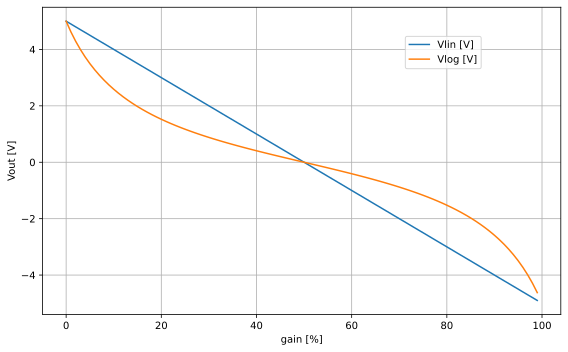
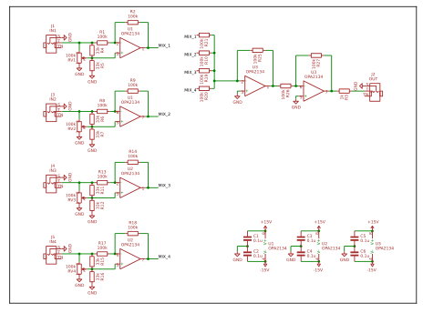
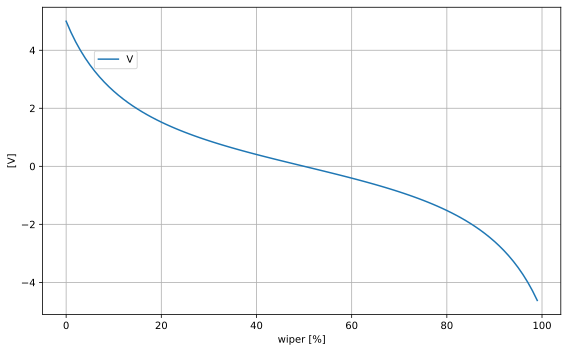
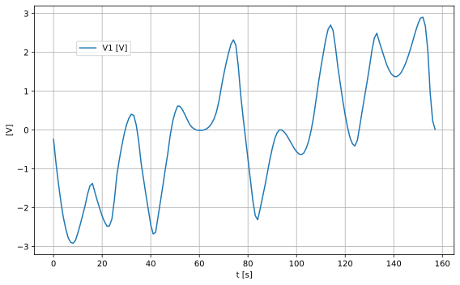

# *kontrast*

***table of contents***

* [*about*](#about)
* [*construction*](#construction)
* [*calibration*](#calibration)
* [*usage*](#usage)
* [*references*](#lreferences)
* [*changelog*](#changelog)

  

## *about*

kontrast ist a simple mixer utility module. it can be used as a **mixer**, **attenuator** or **attenuverter** for ac or dc signals. the function depends on the patching and settings of the potentiometers. an attenuverter is used in different modules like the  Serge VCS, Maths and also in the polivoks filter. while this module can be used as a simple mixer you can also adjust cv signals. such a signal can be simply attenuated or inverted. when feeding in a positive singal slope (for example from an adsr). the signal will be turned to a neagative dc singal. if the inpout signal is ac coupled the signal will be inverted. the function is the setting on the potentiometer of the channel. when the potentiometer is at center position. the output signal is attenuated to zero. no output singal is present. when turning to the right. the signal will be stronger until the output signal is equal to the input signal. when turning the potentiomenter to the left, the output signal will be phase shifted by 180°. when you turn the potentiometer to full left the output signal will be the inverted input signal. all the inputs are mixed to the output signal; unless you connect the output of a channel. then this output does not accure on the mixed signal.

the attenuverter is build around a differential amplifier with an opamp. 

$\displaystyle Vout = \frac{R_{4} Vin_{2} \left(1 + \frac{R_{2}}{R_{1}}\right)}{R_{3} + R_{4}} - \frac{R_{2} Vin}{R_{1}}$

the circuit of the attenuverter is based on the opamp dfferential amplifer. the two resistors at the non-inverting inputs are replaced with a potentiometer. the potentiometer is configured as a voltage divider and replace R3 and R4 from the differential amplifier. when the position of the potentiometer is adjusted, the output voltage will change or invert. at the center position  the output is zero volrs. the response to the potentiometer is linear. we can make it an centered s-curve by adding two parallel resistors (R5,R6) to the potentiometer [[2][2]].

a simulation with the resistance at RV 1 changed from 0-100%. first run is the linear result. the second run is done with the resistors R5 and R6 added. This results in a s curve. the shape of the curve can be changed with the values of the resistors.

## construction

because the channel is silent at potentometer center position, it would be nice to use a potentometer that has a center decent. such potientometers are not easy to find. some examples are [[10][10]]

    .title KiCad schematic
    .include /home/etienne/Documents/elektrophon/lib/spice/transistor/OPA2134.LIB
    .subckt XU1 OUT INVERTING NON_INVERTING POWER_NEGATIVE POWER_POSITIVE
    X1 NON_INVERTING INVERTING POWER_POSITIVE POWER_NEGATIVE OUT OPA2134
    .ends XU1
    
    .subckt voltage_divider n1 n2 n3
    R1 n1 n2 0.0kOhm
    R2 n2 n3 100.0kOhm
    .ends voltage_divider
    VJ1 Net-_J1-PadT_ 0 dc 5 ac 0 sin(0 5 1k)
    R3 Net-_R27-Pad2_ Net-_J2-PadT_ 1k
    XRV1 0 Net-_R4-Pad1_ Net-_J1-PadT_ voltage_divider
    R1 Net-_R1-Pad1_ Net-_J1-PadT_ 100k
    R2 /MIX_1 Net-_R1-Pad1_ 100k
    XU1 Net-_R4-Pad1_ Net-_R1-Pad1_ +15V -15V /MIX_1 OPA2134
    R4 Net-_R4-Pad1_ Net-_J1-PadT_ 33k
    R5 0 Net-_R4-Pad1_ 33k
    R21 /MIX_1 Net-_R10-Pad2_ 100k
    R25 Net-_R10-Pad2_ Net-_R25-Pad2_ 100k
    R26 Net-_R25-Pad2_ Net-_R26-Pad2_ 100k
    R27 Net-_R26-Pad2_ Net-_R27-Pad2_ 100k
    XU2 0 Net-_R10-Pad2_ +15V -15V Net-_R25-Pad2_ OPA2134
    XU3 0 Net-_R26-Pad2_ +15V -15V Net-_R27-Pad2_ OPA2134
    VJ3 Net-_J3-PadT_ 0 dc 5 sin(0 5 2k)
    XRV2 0 Net-_R6-Pad1_ Net-_J3-PadT_ voltage_divider
    R8 Net-_R8-Pad1_ Net-_J3-PadT_ 100k
    R9 /MIX_2 Net-_R8-Pad1_ 100k
    XU4 Net-_R6-Pad1_ Net-_R8-Pad1_ +15V -15V /MIX_2 OPA2134
    R6 Net-_R6-Pad1_ Net-_J3-PadT_ 33k
    R7 0 Net-_R6-Pad1_ 33k
    R10 /MIX_2 Net-_R10-Pad2_ 100k
    VJ4 Net-_J4-PadT_ 0 dc 5 sin(0 5 4k)
    XRV3 0 Net-_R11-Pad1_ Net-_J4-PadT_ voltage_divider
    R13 Net-_R13-Pad1_ Net-_J4-PadT_ 100k
    R14 /MIX_3 Net-_R13-Pad1_ 100k
    XU5 Net-_R11-Pad1_ Net-_R13-Pad1_ +15V -15V /MIX_3 OPA2134
    R11 Net-_R11-Pad1_ Net-_J4-PadT_ 33k
    R12 0 Net-_R11-Pad1_ 33k
    R19 /MIX_3 Net-_R10-Pad2_ 100k
    VJ5 Net-_J5-PadT_ 0 dc 5 sin(0 5 8k)
    XRV4 0 Net-_R15-Pad1_ Net-_J5-PadT_ voltage_divider
    R17 Net-_R17-Pad1_ Net-_J5-PadT_ 100k
    R18 /MIX_4 Net-_R17-Pad1_ 100k
    XU6 Net-_R15-Pad1_ Net-_R17-Pad1_ +15V -15V /MIX_4 OPA2134
    R15 Net-_R15-Pad1_ Net-_J5-PadT_ 33k
    R16 0 Net-_R15-Pad1_ 33k
    R20 /MIX_4 Net-_R10-Pad2_ 100k
    V1 +15V 0 15V
    V2 -15V 0 -15V
    

simulation to check the attenuation function. 

## *calibration*

there is no calibration needed. but the potentiomenter knobs have to be aliged to center position.

## *usage*

the input jacks are wired to 5 volts when nothing is connected.

all channels are mixed to the out jack. when something is connected to the channel out, this channel is removed from the overall mix.

_mixer_
* connect the different channels from audio or cv sources to the in jacks.
* connect the out jack to something
* turn the pots clockwise to adjust the volume.

_attenuverter_
* connect all or a single channel. 
* when you turn the pot knob counter clockwise the signal is inverted.

## *references*

- [Op Amp Differential Amplifier][1] eCircuit  Center
- [Beginners' Guide to Potentiometers][2]  Rod Elliott (ESP)

[1]: http://www.ecircuitcenter.com/Circuits/opdif/opdif.htm
[2]: https://sound-au.com/pots.htm
[10]: https://www.mouser.ch/ProductDetail/ALPS/RK09L114001T?qs=Xb8IjHhkxj78e5CYccfZWg%3D%3D

## *changelog*

---

