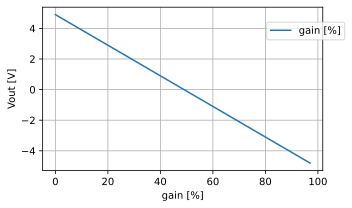
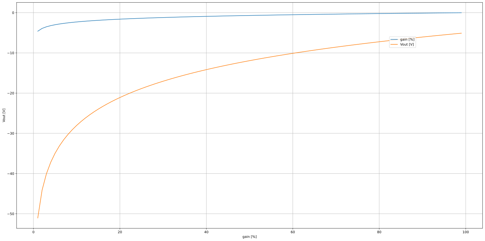

# *kontrast*

## *table of contents*

* [*about*](#about)
* [*construction*](#construction)
* [*calibration*](#calibration)
* [*usage*](#usage)
* [*credits*](#credits)
* [*links*](#links)
* [*changelog*](#changelog)

  
  
## *about*

kontrast ist a simple mixer utility module. it can be used as a **mixer**, **attenuator** or **attenuverter**. the function depends on the patching and settings of the potentiometers. this module is dc coupled, the output signal will correspond to the phase of the input signal. to attenuverter a signal is something that you see in many modules like the Serge VCF, Maths and also in the polivoks filter. while this module can be used as a simple mixer you can also adjust cv signals. such a signal can be simply attenuated or inverted. when feeding in a positive singal slope (for example from an adsr). the signal will be turned to a neagative dc singal. if the inpout signal is ac coupled the signal will be inverted. 

the function is the setting on the potentiometer of the channel. when the potentiometer is at center position. the output signal is attenuated to zero. no output singal is present. when turning to the right. the signal will be stronger until the output signal is equal to the input signal. when turning the potentiomenter to the left, the output signal will be phase shifted by 180°. when you turn the potentiometer to full left the output signal will be the inverted input signal.

this attenuverting stage is done with an potentiometer and an differential amplifier. the voltage divider on the non-inverting input will be replaced with an potentiometer configured as a voltage divider. this setup is a basic linear attenuverter. 

$\displaystyle \frac{R_{4} Vin \left(1 + \frac{R_{2}}{R_{1}}\right)}{R_{3} + R_{4}} - \frac{R_{2} Vin}{R_{1}}$

    .title Test
    .subckt voltage_divider n1 n2 n3
    R1 n1 n2 50kOhm
    R2 n2 n3 50kOhm
    .ends voltage_divider
    V1 +15V 0 15V
    X1 +15V OUT 0 voltage_divider
    
    Node +15v: 15.0 V
    Node out: 7.5 V

    <ipython-input-22-b82aa18e0e44>:7: RuntimeWarning: divide by zero encountered in log
      gain = np.log( gain )

## *construction*

the center building block of the attenuverter is an integrator opamp circuit. 

    ---------------------------------------------------------------------------

    NameError                                 Traceback (most recent call last)

    <ipython-input-24-6f95b56dda24> in <module>
          8 directory_path = Path(os.path.abspath('')).resolve().parent.parent
          9 spice_libraries_path = directory_path.joinpath("lib", "spice", "transistor")
    ---> 10 spice_library = SpiceLibrary(spice_libraries_path)
         11 
         12 class XU1(SubCircuitFactory):

    NameError: name 'SpiceLibrary' is not defined

    ---------------------------------------------------------------------------

    NameError                                 Traceback (most recent call last)

    <ipython-input-25-c4a4d76207ae> in <module>
          4 for s in steps:
          5 
    ----> 6     parser = SpiceParser(path=NETLIST)
          7     circuit = parser.build_circuit(ground='GND')
          8     circuit.include(spice_library['OPA2134'])

    NameError: name 'SpiceParser' is not defined

the input voltage for the amplifier has to be around 100mV. We need to buffer the input signal and attenuate it to that level.

inverting opa amplifier:

\begin{align*}
Vout = -Vin * \left(\frac{R1}{R2}\right)
\end{align*}

## links

1) Rod Elliott (ESP) [Beginners' Guide to Potentiometers][2] 

---

[1]: https://wikipedia.org
[2]: https://sound-au.com/pots.htm

