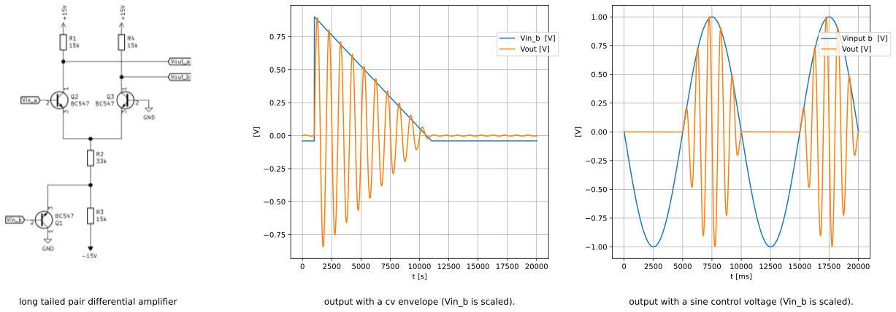
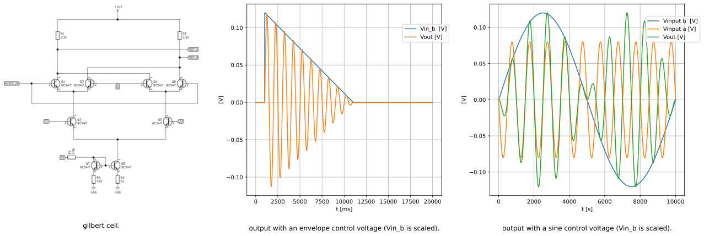

## *pe|gel*

***table of contents***

* [*about*](#about)
* [*construction*](#construction)
* [*calibration*](#calibration)
* [*usage*](#usage)
* [*credits*](#credits)
* [*links*](#links)
* [*changelog*](#changelog)
  
## *about*

pegel is a voltage controlled amplifier (vca). there are various designs to implement a vca. rod elliott (ESP) has an article on vca techniques [[1][1]]. diy synthesizer modules are usualy designed with an integrated vca chip [[2][2]]  or with a differential amplifier [[3][3]]. the integrated vca chips are either obsolete or rather expensive. the differential amplifier can be built with transistors only. the design has some downsides. even in the simulation the result is not symetryc and has a dc offset from the control voltage. this needs a lot of trimming to get an accurate result. but the biggest downside is, that this design can not do proper amplitude modulation (am). when the carrier signal goes below zero the base signal is completely muted. 

    2020-08-16 12:00:15,925 - PySpice.Spice.NgSpice.Shared.NgSpiceShared._send_char - ERROR - Error: bad type for debug var
    2020-08-16 12:00:15,926 - PySpice.Spice.NgSpice.Shared.NgSpiceShared._send_char - WARNING - Warning: ngspice compiled without debug messages

more promising is it to use a four quadrant multiplier, also known as gilbert cell. the gilbert cell is designed around two differential amplifiers. the carrier signal switches between those. the result is a multiplication of the input voltages. the gilbert cell is mostly used for amplitude modulation in radio transmission. if you look at the integratd circuits like the 633 it can modulate signals up in the gigahertz range. the gilbert cell is not described in all details here, there is a good introduction from w2aew [[4][4]].

## *construction*

## *references*

- [VCA Techniques Investigated][1] Rod Elliott (ESP)
- [VCA-1][2] Thomas Henry CA3080 vca
- [VCA-3][3] René Schmitz differential pair vca
- [#223][]: Basics of the Gilbert Cell | Analog Multiplier | Mixer | Modulator

[1]: https://sound-au.com/articles/vca-techniques.html
[2]: https://www.birthofasynth.com/Thomas_Henry/Pages/VCA-1.html
[3]: https://www.schmitzbits.de/vca3.png
[4]: https://www.youtube.com/watch?v=7nmmb0pqTU0&t=2s
[5]: 

[9]: http://www.ecircuitcenter.com/Circuits/BJT_Diffamp1/BJT_Diffamp1.htm

