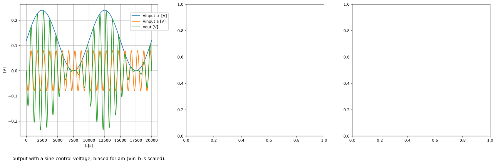
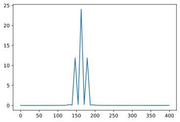
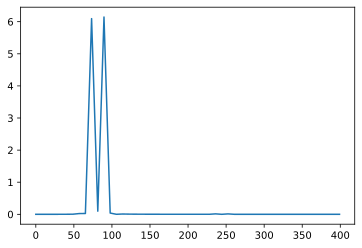
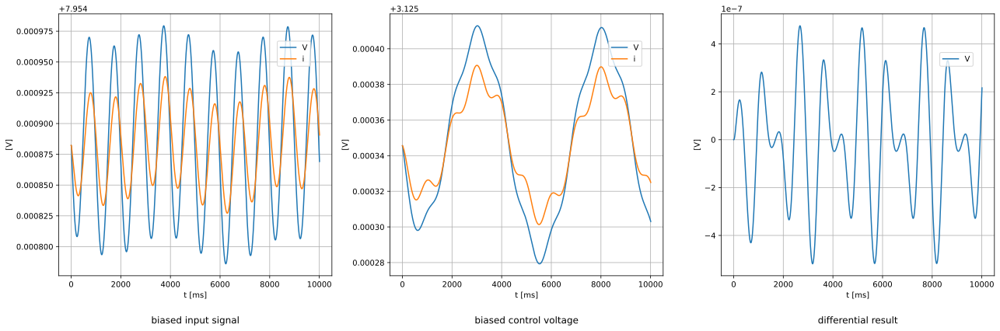

## *pe|gel*

***table of contents***

* [*about*](#about)
* [*construction*](#construction)
* [*calibration*](#calibration)
* [*usage*](#usage)
* [*credits*](#credits)
* [*links*](#links)
* [*changelog*](#changelog)
  
## *about*

pegel is a voltage controlled amplifier (vca). there are various designs to implement a vca. rod elliott (ESP) has an article on vca techniques [[1][1]]. diy synthesizer modules are usualy designed with an integrated vca chip [[2][2]]  or with a differential amplifier [[3][3]]. the integrated vca chips are either obsolete or rather expensive. the differential amplifier can be built with transistors only. the design has some downsides. even in the simulation the result is not symetryc and has a dc offset from the control voltage. this needs a lot of trimming to get an accurate result. but the biggest downside is, that this design can not do proper amplitude modulation (am). when the carrier signal goes below zero the base signal is completely muted. 

    2020-08-16 17:11:25,735 - PySpice.Spice.NgSpice.Shared.NgSpiceShared._send_char - ERROR - Error: bad type for debug var
    2020-08-16 17:11:25,736 - PySpice.Spice.NgSpice.Shared.NgSpiceShared._send_char - WARNING - Warning: ngspice compiled without debug messages

more promising is it to use a four quadrant multiplier, also known as gilbert cell. the gilbert cell is designed around two differential amplifiers. the carrier signal switches between those. the result is a multiplication of the input voltages. the gilbert cell is mostly used for amplitude modulation in radio transmission. if you look at the integratd circuits like the 633 it can modulate signals up in the gigahertz range. the gilbert cell is not described in all details here, there is a good introduction from w2aew [[4][4]].

this is not real amplitude modulation. when the signal is negative the phase of the output is inverted. this can be adjusted by the bias voltage of the control voltage. the control voltage has to be positive at all time. 

## *construction*

for the final circuit input and output buffering and biasing is needed. the buffering is done with opamps. 

    .title KiCad schematic
    .include /home/etienne/Documents/elektrophon/lib/spice/transistor/BC547.mod
    .include /home/etienne/Documents/elektrophon/lib/spice/opamp/OPA2134-dual.lib
    .subckt voltage_divider_1 n1 n2 n3
    R1 n1 n2 100.0kOhm
    R2 n2 n3 0.0kOhm
    .ends voltage_divider_1
    V1 +15V 0 +15
    V2 -15V 0 -15
    Q1 OUT_A Net-_C5-Pad1_ Net-_Q1-Pad3_ BC547B
    Q3 OUT_B Net-_Q3-Pad2_ Net-_Q1-Pad3_ BC547B
    Q4 OUT_A Net-_Q3-Pad2_ Net-_Q4-Pad3_ BC547B
    Q6 OUT_B Net-_C5-Pad1_ Net-_Q4-Pad3_ BC547B
    R9 +15V OUT_A 270
    R13 +15V OUT_B 270
    Q2 Net-_Q1-Pad3_ Net-_C6-Pad1_ Net-_Q2-Pad3_ BC547B
    Q5 Net-_Q4-Pad3_ Net-_Q5-Pad2_ Net-_Q2-Pad3_ BC547B
    R16 +15V Net-_C7-Pad2_ 4.7k
    R17 Net-_C7-Pad2_ Net-_C9-Pad1_ 3.3k
    R18 Net-_C9-Pad1_ 0 2.2k
    C8 Net-_C7-Pad2_ 0 0.1u
    C9 Net-_C9-Pad1_ 0 0.1u
    V3 +5V 0 dc 5
    R15 Net-_C7-Pad2_ Net-_C5-Pad1_ 2.2k
    R11 Net-_C7-Pad2_ Net-_Q3-Pad2_ 2.2k
    R14 Net-_C9-Pad1_ Net-_Q5-Pad2_ 2.2k
    R10 Net-_C9-Pad1_ Net-_C6-Pad1_ 2.2k
    C7 0 Net-_C7-Pad2_ 0.1u
    C5 Net-_C5-Pad1_ in 0.1u
    C6 Net-_C6-Pad1_ cv 0.1u
    R12 Net-_Q2-Pad3_ 0 270
    XU1 Net-_R3-Pad1_ Net-_R1-Pad1_ 0 -15V 0 Net-_R2-Pad1_ Net-_R4-Pad1_ +15V OPA2134d
    R3 Net-_R3-Pad1_ Net-_R1-Pad1_ 100k
    R5 Net-_R5-Pad1_ Net-_R3-Pad1_ 100k
    R1 Net-_R1-Pad1_ Net-_R1-Pad2_ 100k
    XRV1 0 Net-_R1-Pad2_ Net-_J1-PadT_ voltage_divider_1
    VJ1 Net-_J1-PadT_ 0 dc 5 sin(0 20m 1k)
    VJ2 Net-_J2-PadT_ 0 dc 5 sin(0 20m 200)
    XRV2 0 Net-_R2-Pad2_ Net-_J2-PadT_ voltage_divider_1
    R2 Net-_R2-Pad1_ Net-_R2-Pad2_ 100k
    R4 Net-_R4-Pad1_ Net-_R2-Pad1_ 100k
    R6 Net-_R6-Pad1_ Net-_R4-Pad1_ 100k
    R8 0 Net-_R6-Pad1_ 1k
    R7 0 Net-_R5-Pad1_ 1k
    XU2 Net-_R19-Pad1_ Net-_R19-Pad1_ Net-_R5-Pad1_ -15V Net-_R6-Pad1_ Net-_R20-Pad1_ Net-_R20-Pad1_ +15V OPA2134d
    R19 Net-_R19-Pad1_ in 2.2k
    R20 Net-_R20-Pad1_ cv 2.2k
    

    <PySpice.Probe.WaveForm.TransientAnalysis object at 0x7fb63e22dac0>

    Node xu2.xu1b.8: -0.05 V
    Node xu2.xu1b.9:  0.00 V
    Node xu2.xu1b.92: -40.00 V
    Node xu2.xu1b.91: 40.00 V
    Node xu2.xu1b.90:  0.00 V
    Node xu2.xu1b.54: -14.10 V
    Node xu2.xu1b.53: 13.80 V
    Node net-_r20-pad1_: -0.05 V
    Node xu2.xu1b.99:  0.00 V
    Node xu2.xu1b.10: -0.77 V
    Node xu2.xu1b.7: -0.05 V
    Node xu2.xu1b.6:  0.00 V
    Node xu2.xu1b.12: -14.80 V
    Node xu2.xu1b.11: -14.80 V
    Node xu2.xu1a.8: -0.05 V
    Node xu2.xu1a.9:  0.00 V
    Node xu2.xu1a.92: -40.00 V
    Node xu2.xu1a.91: 40.00 V
    Node xu2.xu1a.90:  0.00 V
    Node xu2.xu1a.54: -14.10 V
    Node xu2.xu1a.53: 13.80 V
    Node net-_r19-pad1_: -0.05 V
    Node xu2.xu1a.99:  0.00 V
    Node xu2.xu1a.10: -0.77 V
    Node xu2.xu1a.7: -0.05 V
    Node xu2.xu1a.6:  0.00 V
    Node xu2.xu1a.12: -14.80 V
    Node xu2.xu1a.11: -14.80 V
    Node net-_r6-pad1_: -0.05 V
    Node net-_r2-pad2_:  5.00 V
    Node net-_j2-padt_:  5.00 V
    Node net-_j1-padt_:  5.00 V
    Node net-_r1-pad2_:  5.00 V
    Node net-_r5-pad1_: -0.05 V
    Node xu1.xu1b.8: -5.00 V
    Node xu1.xu1b.9:  0.00 V
    Node net-_r2-pad1_:  0.00 V
    Node xu1.xu1b.92: -40.00 V
    Node xu1.xu1b.91: 40.00 V
    Node xu1.xu1b.90: -0.10 V
    Node xu1.xu1b.54: -14.10 V
    Node xu1.xu1b.53: 13.80 V
    Node net-_r4-pad1_: -5.00 V
    Node xu1.xu1b.99:  0.00 V
    Node xu1.xu1b.10: -0.72 V
    Node xu1.xu1b.7: -5.00 V
    Node xu1.xu1b.6:  0.00 V
    Node xu1.xu1b.12: -14.80 V
    Node xu1.xu1b.11: -14.80 V
    Node xu1.xu1a.8: -5.00 V
    Node xu1.xu1a.9:  0.00 V
    Node net-_r1-pad1_:  0.00 V
    Node xu1.xu1a.92: -40.00 V
    Node xu1.xu1a.91: 40.00 V
    Node xu1.xu1a.90: -0.10 V
    Node xu1.xu1a.54: -14.10 V
    Node xu1.xu1a.53: 13.80 V
    Node net-_r3-pad1_: -5.00 V
    Node xu1.xu1a.99:  0.00 V
    Node xu1.xu1a.10: -0.72 V
    Node xu1.xu1a.7: -5.00 V
    Node xu1.xu1a.6:  0.00 V
    Node xu1.xu1a.12: -14.80 V
    Node xu1.xu1a.11: -14.80 V
    Node cv: -0.05 V
    Node in: -0.05 V
    Node +5v:  5.00 V
    Node net-_c9-pad1_:  3.16 V
    Node net-_c7-pad2_:  7.99 V
    Node net-_q5-pad2_:  3.13 V
    Node net-_q2-pad3_:  2.44 V
    Node net-_c6-pad1_:  3.13 V
    Node net-_q4-pad3_:  7.30 V
    Node net-_q3-pad2_:  7.95 V
    Node out_b: 13.79 V
    Node net-_q1-pad3_:  7.30 V
    Node net-_c5-pad1_:  7.95 V
    Node out_a: 13.79 V
    Node -15v: -15.00 V
    Node +15v: 15.00 V
    Audio input signal is -0.049499 Volts.
    CV input signal is -0.049499 Volts.

## *references*

- [VCA Techniques Investigated][1] Rod Elliott (ESP)
- [VCA-1][2] Thomas Henry CA3080 vca
- [VCA-3][3] René Schmitz differential pair vca
- [#223][]: Basics of the Gilbert Cell | Analog Multiplier | Mixer | Modulator

[1]: https://sound-au.com/articles/vca-techniques.html
[2]: https://www.birthofasynth.com/Thomas_Henry/Pages/VCA-1.html
[3]: https://www.schmitzbits.de/vca3.png
[4]: https://www.youtube.com/watch?v=7nmmb0pqTU0&t=2s
[5]: 

[9]: http://www.ecircuitcenter.com/Circuits/BJT_Diffamp1/BJT_Diffamp1.htm

